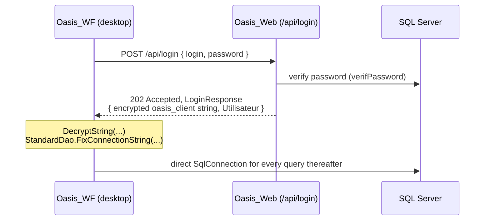

# Oasis

Oasis is a French medical records and care-coordination platform for multidisciplinary care
teams. It is built around the patient *episode*, a unit of care that a doctor, nurse, midwife
or medical secretary each contributes to. On top of that sit consultations, prescriptions,
vaccination records, treatment plans, appointments and patient follow-up.

There are two front ends: a Telerik WinForms desktop client used by clinicians, and an
ASP.NET web portal used by patients. Both are built on a shared domain library.

Windows only. .NET Framework 4.7.2, VB.NET, Visual Studio 2022.

Licensed under [AGPL-3.0](LICENSE) with a section 7 linking exception. See [Licence](#licence).

## Contents

- [Architecture](#architecture)
  - [Projects](#projects)
  - [How authentication works](#how-authentication-works)
  - [Data access](#data-access)
  - [Prescription signing](#prescription-signing)
  - [Document storage](#document-storage)
- [Requirements](#requirements)
- [Local setup](#local-setup)
- [Building](#building)
- [Running](#running)
- [Testing](#testing)
- [Configuration reference](#configuration-reference)
- [Repository layout](#repository-layout)
- [Domain glossary](#domain-glossary)
- [Conventions](#conventions)
- [Known gaps and caveats](#known-gaps-and-caveats)

## Architecture

One Visual Studio solution, `Oasis_WF.sln`, holding six VB.NET projects and one SSIS project.
Every project depends on `Oasis_Common` and on nothing else in the solution.

```
                       ┌──────────────────┐
                       │   Oasis_Common   │  domain core
                       │  Bean/ · Dao/    │  POCOs + ADO.NET data access
                       │  Module/ ApiRest │  helpers, REST client, mail
                       └────────▲─────────┘
             ┌──────────────┬───┴────┬──────────────┬─────────────┐
             │              │        │              │             │
      ┌──────┴─────┐ ┌──────┴────┐ ┌─┴──────────┐ ┌─┴─────────┐ ┌─┴──────┐
      │  Oasis_WF  │ │ Oasis_Web │ │OasisAdmini │ │ Automate… │ │UnitTest│
      │  WinForms  │ │ MVC + API │ │  WinForms  │ │  console  │ │ MSTest │
      │  clinician │ │  patient  │ │  unlock    │ │  batch    │ │        │
      └────────────┘ └───────────┘ └────────────┘ └───────────┘ └────────┘
```

### Projects

| Project | Output | Purpose |
|---|---|---|
| `Oasis_Common/` | Library | The domain core. `Bean/` (POCOs) and `Dao/` (data access) mirror each other folder for folder by domain. Also holds global helpers, reference-data singletons, the REST client and mail utilities. |
| `oasis/` (`Oasis_WF`) | WinExe | The clinician desktop client, and the bulk of the codebase at roughly 140k lines. Telerik WinForms, distributed via ClickOnce. |
| `Oasis_Web/` | Web app | Serves two audiences. MVC controllers and Razor (`.vbhtml`) views make up the patient portal; the Web API 2 `ApiController`s are what the desktop client depends on. |
| `OasisAdmini/` | WinExe | Small utility that unlocks a workstation after repeated failed logins. |
| `AutomateTraitementOasis/` | Exe | Console entry point for scheduled batch processing. Currently a stub. |
| `UnitTest/` | Library | MSTest suite covering `Oasis_Common` helpers and bean serialization. |
| `Oasis_IS/` | SSIS | Integration Services ETL package, edited in the SSDT designer. |
| `OasisSetup/` | Installer | Visual Studio Installer (`.vdproj`) project. Needs a marketplace extension, see [Requirements](#requirements). |

Two kinds of user exist and are easy to confuse. A `Utilisateur` is a clinician (doctor,
IDE/nurse, midwife, secretary) who signs into the desktop client. An `Internaute` is a patient
who signs into the web portal at `/Auth/Login`.

### How authentication works

This is the least obvious part of the system. Read it before touching anything to do with auth
or data access.

The desktop client does not know the database credentials. `oasis/App.config` ships with an
empty connection string, which is filled in at runtime, once, at login:



1. The client POSTs a `LoginRequest` to `https://{ServeurOasis}/api/login`.
2. `LoginController` verifies the password against the database, then returns a `LoginResponse`
   carrying the AES-encrypted connection string and the authenticated `Utilisateur`. The bean is
   stripped of its password hash and signing key before it leaves the server. Encryption is
   `EncryptString`, keyed by the `OasisCryptoKey` setting, which the server and every client must
   share. See [Cryptographic key](#cryptographic-key).
3. `StandardDao.FixConnectionString` decrypts it and injects it into the read-only
   `ConfigurationManager` entry by reflection, clearing the private `_bReadOnly` field.
4. Every DAO from then on opens a direct `SqlConnection`.

Two things follow from this. The desktop app talks to SQL Server directly, so the web API does
authentication, signing, password changes, and relays file uploads, downloads and mail. And
changing the shape of the `/api/login` response will break every deployed client, so it ships with
a ClickOnce release.

See `Oasis_Common/ApiRest/ApiOasis.vb`, `Oasis_Web/Controllers/LoginController.vb`,
`Oasis_Common/Dao/StandardDao.vb` and `oasis/Menu/FAuthentification.vb`.

#### Two database accounts

The string handed out at step 2 is not the one the server uses. `Web.config` holds both:

| Entry | SQL login | Who gets it |
|---|---|---|
| `Oasis_WF.My.MySettings.oasisConnection` | `oasis_web` | the server only, never leaves the machine |
| `Oasis_WF.My.MySettings.oasisConnectionClient` | `oasis_client` | distributed to every workstation by `/api/login` |

`OasisCryptoKey` also ships to every workstation, so the encryption protects the string on the wire
and nothing else. Anything `oasis_client` can read, assume any user can read. That account is
therefore denied the columns that would let one user become another:

- `oa_utilisateur.cle_privee` and `.cle_publique`, the prescriber signing keys
- `oa_utilisateur.oa_password`, the password hashes
- `oa_internaute.password` and `.recovery`, the patient portal credentials
- `oa_r_mail_parameter.smtp_params`, the mail account

Signing, key generation and password changes go through `/api/signature`, `/api/signature/cle` and
`/api/motdepasse` instead. `Utilisateur.Sign` picks the route itself: it signs locally when a
private key is loaded (server) and calls the `SignataireDistant` hook otherwise (client).

Run `docs/migrations/2026-08-24-comptes-sql-separes.sql` before deploying, and note that a `SELECT *`
against any of those tables now fails for the client. List columns explicitly.

### Data access

Hand-written ADO.NET. No ORM, no migrations. Every DAO inherits `StandardDao` and follows one
shape. `Oasis_Common/Dao/Patient/PatientDao.vb` is the reference implementation:

```vb
Public Class XxxDao
    Inherits StandardDao

    ' one place maps a row to a bean; Shared so joining DAOs can reuse it
    Shared Function BuildBean(reader As SqlDataReader) As Xxx

    Public Function GetXxx(id As Integer) As Xxx
        Dim con As SqlConnection = GetConnection()
        Try
            ' parameterised SqlCommand -> Using reader -> BuildBean
        Catch ex As Exception
            Throw ex
        Finally
            con.Close()
        End Try
    End Function
End Class
```

Tables live in the `oasis` schema and are named `oa_*`, with reference tables as `oa_r_*`. SQL
sits inline in the DAO and is always parameterised with `AddWithValue`. `Coalesce(reader("col"),
default)` from `ModuleUtilsBase` absorbs `DBNull`.

Reference data (genres, sites, specialities, ALD and so on) is cached in singletons declared in
`Oasis_Common/Module/EnvironnementBase.vb`, each loading its table once on first use. Session
state after login lives in module-level globals, `userLog` and `loginRequestLog`, in
`oasis/Module/CacheGlobal.vb`.

### Prescription signing

Prescriptions (`Ordonnance`) carry a cryptographic signature made with secp256k1 keys via
Nethereum.

`Ordonnance`, `OrdonnanceDetail` and `OrdonnanceFull` implement hand-rolled binary `Serialize()`
and `Deserialize()` using `BinaryWriter`. Field order is the wire format, so appending or
reordering a property invalidates every signature already issued. `UnitTest/Ordonnance.test.vb`
round-trips the serialization; run it after any bean change.

`Utilisateur.Sign` hashes and signs with the clinician's private key, and the result is stored in
`oa_ordonnance_signature`. Anyone can verify a printed prescription at
`/Sign/Check/{base64url-signature}`, which renders it from the database
(`Oasis_Web/Controllers/SignController.vb`). That URL is encoded as a QR code on the printout,
generated with QRCoder in `oasis/Pdf/PrtOrdonnance.vb`.

### Document storage

Sub-episode documents (DOCX and PDF) are not stored in the database. `SousEpisode.GetContenu` and
`WriteContenuModel` move bytes through the REST API into the server directory named by
`FileUploadLocation`, under a filename built by `getFilenameServer()`:

```
SousEpisode\Episode_{episodeId}_SousEpisode_{id}_SousEpisodeSousType_{typeId}.DOCX
```

Documents are produced with GemBox.Document and Telerik Documents. Mail goes out through MailKit
behind `/api/sendMail`.

## Requirements

Oasis is Windows only. It targets .NET Framework 4.7.2, uses Windows Forms, and builds with
MSBuild from Visual Studio. It will not build on macOS or Linux, and there is no .NET Core or
.NET 5+ path.

### Required

| Requirement | Version | Notes |
|---|---|---|
| Windows | 10 or 11, or Server 2016+ | |
| Visual Studio | 2022 (17.0+) | Community edition is enough. |
| Workload: *.NET desktop development* | | Provides VB.NET and the Windows Forms designers. |
| Workload: *ASP.NET and web development* | | Provides IIS Express for `Oasis_Web`. |
| .NET Framework 4.7.2 Developer Pack | | Targeting pack and runtime. The workloads above usually install it, but check. |
| SQL Server | 2016 or newer | Express is fine for development. Must host the `oasis` schema, see the caveat under [Local setup](#local-setup). |
| NuGet CLI | 5.0+ | Or restore from inside Visual Studio. `packages/` is not committed. |

### Situational

| Requirement | Needed for |
|---|---|
| Telerik UI for WinForms licence | Building `Oasis_WF` at all. The assemblies are not in this repository. See below. |
| SQL Server Data Tools (SSDT) | Opening or editing the `Oasis_IS` SSIS project. Comes with the *Data storage and processing* workload. |
| [Microsoft Visual Studio Installer Projects](https://marketplace.visualstudio.com/items?itemName=VisualStudioClient.MicrosoftVisualStudioInstallerProjects) extension | Opening `OasisSetup` (`.vdproj`). Without it the solution loads with that one project unavailable, which is harmless unless you need the installer. |
| SMTP account | Outbound mail via `/api/sendMail`. |

### Telerik setup

The desktop client is built on Telerik UI for WinForms. Those assemblies are commercial and are
not distributed with this repository, so you supply your own copy. The build expects version
**2022.2.622.40** (Telerik R2 2022).

Get a licence from [Telerik](https://www.telerik.com/products/winforms.aspx), install through the
Telerik Control Panel, then point the build at the install. Any one of these works, and the build
takes the first it finds:

| | How | When to use it |
|---|---|---|
| 1 | `msbuild /p:TelerikWinFormsDir="C:\path\to\Bin40"` | One-off or scripted builds |
| 2 | `setx TELERIK_WINFORMS_DIR "C:\path\to\Bin40"` | Normal developer setup, and CI agents |
| 3 | Copy `Telerik.props.user.example` to `Telerik.props.user` and edit the path | When you want the setting to live with the checkout. The file is gitignored |
| 4 | Nothing | The Control Panel default path is found automatically: `C:\Program Files (x86)\Progress\Telerik UI for WinForms R2 2022\Bin40` |

Point it at a **complete `Bin40` folder**, not a hand-picked copy of the referenced DLLs. The
Visual Studio WinForms designer loads design-time assemblies that the compiler never references.
A minimal copy compiles fine while every `RadForm` fails to open in the designer, which is a
frustrating failure to diagnose.

Ten assemblies are referenced, and only by `Oasis_WF`. `Oasis_Common` used to need the first two
for a single view-model class, `ItemUniteSite`, which is bound to one screen and now lives beside
it in `oasis/Form/tache/`. That leaves the library, the web application, the admin tool and the
tests free of any commercial dependency, which is what lets them build in continuous integration:

```
Telerik.WinControls.dll                          TelerikCommon.dll
Telerik.WinControls.UI.dll                       Telerik.WinControls.GridView.dll
Telerik.WinControls.ChartView.dll                Telerik.WinControls.Scheduler.dll
Telerik.WinControls.RichTextEditor.dll           Telerik.Windows.Documents.Core.dll
Telerik.WinControls.Themes.Office2007Silver.dll  Telerik.Windows.Zip.dll
```

If Telerik cannot be found the build stops with one message rather than hundreds of type errors:

| Code | Meaning |
|---|---|
| `OASIS001` | No installation found by any of the four methods above |
| `OASIS002` | The path resolved but `Telerik.WinControls.dll` is not in it. It is probably not a `Bin40` folder |
| `OASIS003` | Warning only. Runtime assemblies found but design-time ones missing, so builds work and designers do not |

Resolution lives in `Directory.Build.props` at the repository root, and applies to `Oasis_WF` only.

> **Not yet verified against a real build.** The Telerik indirection was written on a machine
> without MSBuild. Someone should complete the checklist in
> `docs/specs/2026-08-23-agpl-relicensing-and-telerik-externalisation.md` on Windows before this
> is relied on.

## Local setup

> **Read this first.** The repository contains no database schema. There is no `.sql`, no
> `.dacpac`, no migrations. The `oasis` schema exists only on a live server, so you cannot create
> a working database from this repository alone. You need access to an existing Oasis SQL Server,
> or a backup restored from one. Everything below assumes you have that.

**1. Clone and restore packages**

```powershell
git clone git@github.com:Synovora/DSO.git
cd DSO
nuget restore Oasis_WF.sln
```

**2. Point the web app at your database**

`Oasis_Web/Web.config` is tracked with placeholder values. Fill them in locally, using
[`Oasis_Web/Web.config.example`](Oasis_Web/Web.config.example) as the guide:

```xml
<add name="Oasis_WF.My.MySettings.oasisConnection"
     connectionString="Data Source=localhost\SQLEXPRESS;Initial Catalog=oasis;persist security info=True;user id=oasis_web;password=…;encrypt=true;trustServerCertificate=false;MultipleActiveResultSets=True"
     providerName="System.Data.SqlClient" />
<add name="Oasis_WF.My.MySettings.oasisConnectionClient"
     connectionString="Data Source=localhost\SQLEXPRESS;Initial Catalog=oasis;persist security info=True;user id=oasis_client;password=…;encrypt=true;trustServerCertificate=false;MultipleActiveResultSets=True"
     providerName="System.Data.SqlClient" />
```

Two logins, neither of them `sa`: `oasis_web` for the server, `oasis_client` for what `/api/login`
hands to workstations. Create both, then run
[`docs/migrations/2026-08-24-comptes-sql-separes.sql`](docs/migrations/2026-08-24-comptes-sql-separes.sql)
to apply the column-level denials. Do not commit the filled-in file: it is tracked, so a real
password would be published.

`trustServerCertificate=false` means SQL Server has to present a certificate the machine trusts.
On a development box without one, set it to `true` locally and never in production: the client
connection string travels to every workstation, so an unauthenticated TLS session hands the
credentials to anyone who can answer on port 1433.

**3. Create the document directory**

```powershell
mkdir c:\db\oasis\upload
mkdir c:\db\oasis\upload\SousEpisode
```

This has to match `FileUploadLocation` in `Web.config`, and the IIS Express user needs write
access to it.

**4. Point the desktop client at your local API**

In `oasis/App.config`, switch `ServeurOasis` from production to IIS Express:

```xml
<!-- <add key="ServeurOasis" value="api.synovora.com" /> -->
<add key="ServeurOasis" value="localhost:44355" />
```

`ApiOasis` always prefixes `https://`, so the value carries no scheme. Port 44355 is the
`IISExpressSSLPort` set in `Oasis_Web.vbproj`. Leave the client's own `connectionString` empty,
since it gets populated at login by design.

**5. Build and run**

Start `Oasis_Web` first. The desktop client cannot log in without it. See [Running](#running).

## Building

```powershell
nuget restore Oasis_WF.sln                            # packages/ is gitignored
msbuild Oasis_WF.sln /p:Configuration=Debug
msbuild oasis\Oasis_WF.vbproj /p:Configuration=Debug  # a single project
msbuild Oasis_WF.sln /t:Rebuild /p:Configuration=Release
```

Configurations are `Debug`, `Release` and `Development`. `Development` maps to `Debug` for every
VB project; it exists only so the SSIS project gets its own configuration.

Adding a source file means editing the `.vbproj` by hand. These are old-style MSBuild projects
with explicit `<Compile Include="…" />` lists rather than SDK-style globbing, so a `.vb` file
that is not listed will not compile, and will fail silently.

## Running

| App | How |
|---|---|
| `Oasis_Web` | Set as startup project in Visual Studio and press F5. Serves on `https://localhost:44355` under IIS Express. Has to be running before the desktop client can log in. |
| `Oasis_WF` | Set as startup project and press F5, or run `oasis\bin\Debug\Oasis_WF.exe`. Needs `ServeurOasis` to be reachable. |
| `OasisAdmini` | `OasisAdmini\bin\Debug\OasisAdmini.exe`. Unlocks a workstation after `MAX_TRY` failed logins. |
| `AutomateTraitementOasis` | `AutomateTraitementOasis\bin\Debug\AutomateTraitementOasis.exe`. Currently a stub. |
| `Oasis_IS` | Open in Visual Studio with SSDT and run the package from the designer. |

The desktop login screen (`FAuthentification`) lets you pick a profile, médecin, IDE, sage-femme
or secrétaire, which selects the `Utilisateur` row the session runs as.

### Deployment

`Oasis_WF` is published via ClickOnce to the host configured in `oasis/Oasis_WF.vbproj`
(`PublishUrl`, `InstallUrl`, `UpdateUrl`). Clients check for updates on launch and are required to
take them, via `UpdateRequired` and `MinimumRequiredVersion`. Publish output lands in `oasis/s/`,
which is build output and is not tracked.

Because every deployed client fetches its database credentials from `/api/login`, rotating the
database password only requires updating the server's `Web.config`. Any client still holding a
cached connection string will fail until it logs in again.

## Testing

MSTest, through Test Explorer in Visual Studio or from the command line:

```powershell
vstest.console.exe UnitTest\bin\Debug\UnitTest.dll
vstest.console.exe UnitTest\bin\Debug\UnitTest.dll /Tests:IsValidEmail   # a single test
```

The suite covers `Oasis_Common` helpers (`Coalesce`, the encryption round-trip, email and password
validation, date arithmetic), `Ordonnance` binary serialization, password hashing, the delegated
signing hook and document name validation. It does not need a database. Coverage of the DAO and UI
layers is minimal.

### Continuous integration

Two workflows in `.github/workflows`, running on `main` and `dev` and on pull requests between
them:

| Workflow | What it does |
|---|---|
| `build.yml` | Restores packages, builds `Oasis_Common`, `Oasis_Web`, `OasisAdmini`, `AutomateTraitementOasis` and `UnitTest` on a Windows runner, then runs the test suite and uploads the results |
| `dependency-review.yml` | Fails a pull request that introduces a dependency carrying an advisory at moderate severity or above |

The build job needs nothing commercial, which is why `ItemUniteSite` was moved out of
`Oasis_Common`. The desktop client is a second, optional job: it builds only where Telerik can be
supplied, through the repository secret `TELERIK_BIN40_URL` or a self-hosted runner with Telerik
installed, and is skipped rather than failed elsewhere.

`Oasis_IS` (SSIS) and `OasisSetup` (`.vdproj`) are not built by CI. Both need Visual Studio
extensions that no hosted runner carries.

Dependency review only runs on pull requests. Work that goes straight onto a branch never passes
through it, which is the reason to merge `dev` into `main` through a PR rather than pushing.

## Configuration reference

`oasis/App.config` holds the domain tuning parameters the desktop client reads at runtime. The
ones worth knowing:

| Key | Meaning |
|---|---|
| `ServeurOasis` | Host of the Oasis REST API. No scheme, no trailing slash. |
| `CheminTelechargement` | Local download directory for generated documents. |
| `organisation` | Organisation name shown in the UI and on printed output. |
| `horizonTraitementObsolete` | Years after which a treatment counts as obsolete. |
| `limiteAgeEnfant`, `AgeAdulteHomme`, `AgeAdulteFemme`, `AgeMinPreventionFemme` | Age thresholds driving prevention and screening rules. |
| `dureeRendezVous`, `DureeRendezVousParDefaut` | Appointment length in minutes. |
| `drcId*`, `DrcId*` | DRC codes for default conclusions, strategies and care pathways (pregnancy, pre-school and school follow-up, gynaecology). |
| `ParametreIdTaille`, `ParametreIdIMC`, `ParametreIdPAM` | Row IDs of height, BMI and mean arterial pressure in the parameters table. |
| `ChaineEpisodePeriode` | Episode-chaining window in months. |
| `SpecialiteDelaiPriseEnCharge` | Target time to treatment for a speciality, in days. |
| `TelerikWinFormsThemeName` | Telerik theme applied at startup. |
| `UriProcedureTutorielle` | Base URL of the documentation wiki. No fallback: unset, the tutorial screen reports a configuration error. |
| `ContactAdministrateur` | Support message shown in error dialogs. |
| `MaintenancePasswordSha256` | SHA-256 of the password that opens the maintenance screen from the login form (empty login plus this password). Left at its `CHANGE_ME` value, the screen is unreachable. |
| `UrlPortailPublique` | Public address used in prescription QR codes and password recovery links. Empty falls back to `ServeurOasis`. |
| `GemBoxLicense` | GemBox.Document licence key. Empty means evaluation mode, which stamps a notice on generated documents. |
| `CheminTelechargement` | Obsolete. Documents received from correspondents now go to `%LOCALAPPDATA%\Oasis\cache` and are purged on exit. |

`Oasis_Web/Web.config` needs `ServeurOasis`, `FileUploadLocation`, `OasisCryptoKey`,
`MailDomainesAutorises` and both connection strings. See
[`Web.config.example`](Oasis_Web/Web.config.example).

`MailDomainesAutorises` is a semicolon-separated list of domains `/api/sendMail` will write to.
Addresses already known to the database, meaning the patient on the record and the entries in the
professional directory, are accepted whatever their domain, so an empty list is a usable starting
point. Without it, any authenticated account could send mail with an attachment to any address in
the world from the organisation's SMTP account.

### Cryptographic key

`OasisCryptoKey` is the symmetric key behind `EncryptString` and `DecryptString`, which is how the
connection string reaches desktop clients through `/api/login`. Generate at least 32 random
characters:

```bash
openssl rand -base64 32
```

Set the identical value in **both** `Oasis_Web/Web.config` (server) and `oasis/App.config`
(client). They must match: the server encrypts with it and the client decrypts with it. Missing or
blank, the application raises a configuration error at the first login rather than falling back to
anything.

Because every deployed client carries the key in its own `App.config`, changing it is a
coordinated release, not a server-side edit. Ship the server config and a new ClickOnce build
together, and raise `MinimumRequiredVersion` so clients cannot skip it.

Until 2026-08-23 this key was a constant in `Oasis_Common/Module/ModuleUtilsBase.vb`. That value is
public and must never be reused. See [`docs/runbooks/credential-rotation.md`](docs/runbooks/credential-rotation.md).

`AllowInvalidServerCertificate` disables TLS certificate validation for calls to the Oasis API.
Leave it `false`. Those calls carry database credentials, so turning it on lets anyone on the
network path impersonate the server. It exists only for local testing against a self-signed
certificate.

## Repository layout

```
DSO/
├── Oasis_WF.sln                  solution, open this
├── Oasis_Common/                 shared domain core
│   ├── Bean/<Domain>/            POCOs, one folder per domain
│   ├── Dao/<Domain>/             ADO.NET data access, mirrors Bean/
│   │   └── StandardDao.vb        base class: connection + credential injection
│   ├── Module/                   EnvironnementBase (enums, singletons), ModuleUtilsBase, outils
│   ├── ApiRest/ApiOasis.vb       HTTP client for the REST API
│   └── MailUtils/                MailKit wrappers
├── oasis/                        Oasis_WF, clinician desktop client
│   ├── Menu/                     FrmMain, FAuthentification, splash, about
│   ├── Form/<Domain>/            RadF* screens, one folder per domain
│   ├── Module/                   Environnement, CacheGlobal (session globals)
│   ├── Pdf/                      printed prescriptions, vaccination record, summary
│   ├── UtilsUI/                  shared UI helpers
│   ├── localization/             French Telerik localization providers
│   └── *.xsd                     typed DataSets used by report bindings
├── Oasis_Web/                    patient portal + REST API
│   ├── Controllers/              MVC controllers and Web API ApiControllers
│   ├── Views/                    Razor .vbhtml
│   ├── Models/                   view models
│   ├── App_Start/                routing, bundles, filters, Web API config
│   └── Areas/HelpPage/           generated API help pages
├── OasisAdmini/                  workstation unlock utility
├── AutomateTraitementOasis/      batch console entry point
├── UnitTest/                     MSTest suite
├── Oasis_IS/                     SSIS ETL package
├── OasisSetup/                   Visual Studio Installer project
└── lib/RCWF/                     local Telerik install, if you keep one here. Not tracked
```

## Domain glossary

The domain vocabulary is French and identifiers follow it. New code should match.

| Term | Meaning |
|---|---|
| Épisode, Sous-épisode | A unit of care, and one professional's contribution to it. |
| DRC | *Dictionnaire des Résultats de Consultation*, the standard French consultation-result coding system. |
| PPS | *Plan Personnalisé de Santé*, a personalised care plan: objectives, preventive measures, follow-up, strategy. |
| ALD | *Affection de Longue Durée*, a long-term condition with special reimbursement status. |
| ROR | *Répertoire Opérationnel des Ressources*, the regional directory of care resources. |
| Ligne de vie | The patient's chronological care timeline. |
| Ordonnance | Prescription. |
| Thériaque | French drug reference database. |
| NIR, INS | French social-security number, national health identifier. |
| IDE | *Infirmier(ère) Diplômé(e) d'État*, registered nurse. |
| Internaute | A patient using the web portal, as opposed to a `Utilisateur` (clinician). |
| Autosuivi | Patient self-monitoring. |
| Carnet vaccinal | Vaccination record. |

## Conventions

Screens are Telerik `RadForm`s named `RadF<Domain><Purpose>`, under `oasis/Form/<Domain>/`, each
with a generated `.Designer.vb` and a `.resx`. Never hand-edit a `.Designer.vb`.

Forms take their inputs as properties (`SelectedPatient`, `UtilisateurConnecte`,
`EcranPrecedent`) set by the caller before `Show`, not as constructor arguments.

Navigation around the Synthèse, Épisode and Ligne de vie triangle threads an
`EnumAccesEcranPrecedent` so a screen knows where it was opened from. `ControleAccesForm` and
`ControleAccesEpisode` stop the same screen or episode being opened twice.

Every project sets `Option Strict Off` and `Option Infer On`, with a long `NoWarn` list. Late
binding and implicit conversions are everywhere, and the compiler will not catch type errors for
you.

UI strings, comments and identifiers are French. Keep them that way.

## Known gaps and caveats

Documented rather than hidden. Several of these are load-bearing.

**No database schema is version-controlled.** There is no DDL, seed data or migration tooling
anywhere in the repository. The schema lives only in deployed databases, so it cannot be reviewed,
diffed or recreated. Extracting a `.dacpac` into the repo would be the single highest-value
improvement available.

**Signing keys are stored in plaintext** in `oasis.oa_utilisateur.cle_privee`. The key no longer
leaves the server, and the `oasis_client` login is denied both read and write on the column, so a
workstation can neither steal a prescriber's key nor replace it. The database still holds it in the
clear, which leaves anyone with `oasis_web` rights, or a backup, able to sign as any clinician.
Closing that means encrypting the column, see
[`docs/runbooks/credential-rotation.md`](docs/runbooks/credential-rotation.md) step 6.

**Clients hold database credentials.** `/api/login` hands every desktop client a connection string,
so authorisation in the client is presentation only: a determined user can open the database
directly with the rights of `oasis_client`. Those rights now exclude every credential in the
schema, but they still cover the clinical tables, so one user can read what their profile does not
show them on screen. Per-profile SQL logins, then moving data access behind the API, is the real
fix. Until then, treat the desktop application as trusted code run by trusted staff.

**`EncryptString` derives its IV from the key.** `Rfc2898DeriveBytes` produces both key and IV from
the same passphrase and a fixed salt, so identical plaintext gives identical ciphertext. It is used
for the connection string in the `/api/login` response, not for stored data. Changing it breaks
every deployed client at once, so it belongs in the same release as a key rotation.

**Telerik is a commercial dependency** and is not distributed with this repository. See
[Telerik setup](#telerik-setup).

**`oasis/Form/Obsolete/` is still compiled** into the build, despite the name.

**Dependencies are pinned to 2019-2021 releases** (ASP.NET Core 2.2 packages, Newtonsoft.Json
12.0.3, BouncyCastle 1.8.9) and carry known advisories. See the repository's Dependabot alerts.

**`AutomateTraitementOasis` is a stub.** `Main` prints a line and opens a message box.

## Licence

Oasis is free software licensed under the
[GNU Affero General Public License v3.0](LICENSE) (AGPL-3.0), with an additional permission under section 7
allowing it to be linked with Telerik UI for WinForms, Telerik Document Processing and
GemBox.Document. Without that permission the AGPL would forbid distributing Oasis binaries at all,
since those libraries are proprietary.

If you run a modified Oasis as a network service, AGPL section 13 obliges you to offer your users
the corresponding source.

Third-party components keep their own licences and do not become AGPL by being used here. See
[NOTICE](NOTICE).

Copyright © 2026 Synovora.

### Healthcare disclaimer

Oasis is not a certified medical device and carries no warranty of any kind, express or implied,
including fitness for a particular purpose. It is not a substitute for professional clinical
judgement.

Anyone deploying Oasis is responsible for validating it for their intended use and for meeting the
regulatory, data-protection and patient-safety obligations of their jurisdiction. In the European
Union that may include the Medical Device Regulation and the GDPR; in France it may additionally
include HDS certification for hosting personal health data. Those assessments are the deployer's
responsibility, not the authors'.
